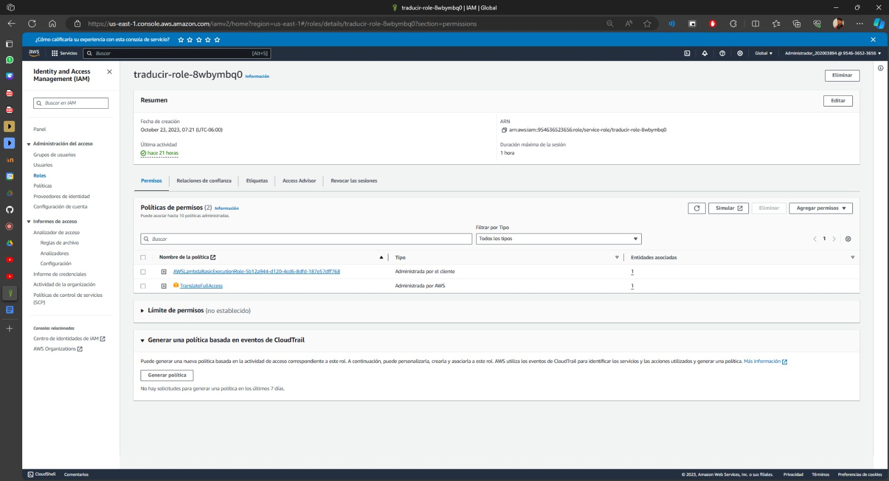

# Manual de Técnico
Este manual técnico proporciona una visión detallada de la arquitectura y la configuración técnica que respalda el funcionamiento interno de nuestra aplicación. La arquitectura se ha diseñado cuidadosamente utilizando servicios de AWS (Amazon Web Services) para garantizar un rendimiento óptimo, escalabilidad y seguridad. A lo largo de este manual, se describirán los componentes clave que forman parte de esta arquitectura y se brindarán instrucciones detalladas sobre su configuración y funcionamiento.

## Arquitectura
.png)

- **S3 (Amazon Simple Storage Service):** Utilizamos un bucket de S3 con su respectivo usuario IAM, se utilizó para almacenar imágenes de perfil, tales como publicaciones y fotos de perfil. Esto se configura con políticas públicas para garantizar el acceso desde la aplicación.

- **EC2 (Amazon Elastic Compute Cloud):** Contamos con dos instancias de EC2 con su respectivo usuario IAM, estas instancias albergan nuestra imagenes de Docker que contiene nuestros contenedores con el frontend, el servidor y la base de datos. El Frontend fue desarrollado utilizando el framework de Angular. El servidor se ejecutan en NodeJS, y se configuran para permitir solo los puertos necesarios según los grupos de seguridad. La base de datos se ejecuta en MySQL.

- **Amazon Cognito:**
En este servicio, configuramos un pool de usuarios que permite el registro de usuarios en la aplicación. Cada usuario registrado y aquellos que actualicen sus datos se almacenan en este pool. Estos datos también se actualizan cuando el usuario modifica su información desde la aplicación. Además, implementamos la verificación por correo electrónico utilizando Cognito para mejorar la seguridad y la autenticación de los usuarios.
- **Amazon Rekognition:**
Utilizamos Rekognition para obtener una lista de etiquetas de las imágenes que se publican en la aplicación. Estas etiquetas se utilizan para realizar filtros en las publicaciones y para habilitar el inicio de sesión a través del reconocimiento facial.
- **Amazon Translate:**
Utilizamos Rekognition para obtener una lista de etiquetas de las imágenes que se publican en la aplicación. Estas etiquetas se utilizan para realizar filtros en las publicaciones y para habilitar el inicio de sesión a través del reconocimiento facial.
- **Amazon API Gateway y Lambda:**
Implementamos una API y una función Lambda en las funcionalidades de Translate.
- **Seguridad IAM:**
Garantizamos la seguridad de nuestra aplicación configurando correctamente los Security Groups y los permisos asignados a los usuarios IAM. Además, aseguramos que los endpoints de nuestro servidor backend estén protegidos mediante la utilización de JSON Web Tokens (JWT). Esto ayuda a proteger la comunicación y la integridad de los datos transmitidos entre la aplicación y el servidor.

## Digrama Entidad-Relación

- **IAM (Identity and Access Management):** se crearon usuarios de IAM para S3, Translate, Cognito, Rekognition y Lex según fuera necesario para el manejo y uso de los servicios de AWS, cada uno con sus políticas asociadas.
    #### **IAM permisos y roles:**
    - **Translate, Lambda y Gateway**

    - **EC2 y S3**

    - **Cognito y Rekognition**

    #### **Security Groups:**
    
    

## Estructura del proyecto
### Backend
El backend se encuentra Dockerizado en dos contenedores uno para el servidor y otro para  la base de datos. El servidor desarrollado en NodeJS. El servicio de NodeJS contiene las mismas rutas. A continuación, se muestra la estructura de carpetas del backend:

El servidor utiliza el modelo de arquitectura MVC (Modelo-Vista-Controlador). Como se puede ver a continuación:

NodeJS arquitectura MVC

Para levantar el proyecto de NodeJS basta con ejecutar el comando para instalar la librerías `npm install` y luego un `npm run dev` en la carpeta del proyecto. 

### Frontend
Desarrollado en Angular 16, el frontend de nuestra aplicación se divide en varias componentes principalmente en: **Sidebar**, **SidebarAdmin**. Cada uno de estos componentes se divide en subcomponentes que se encargan de mostrar la información de la aplicación. A continuación, se muestra la estructura de carpetas del frontend:

Estructura principal de carpetas del frontend

## Funcionalidades desarrolladas y división de tareas

